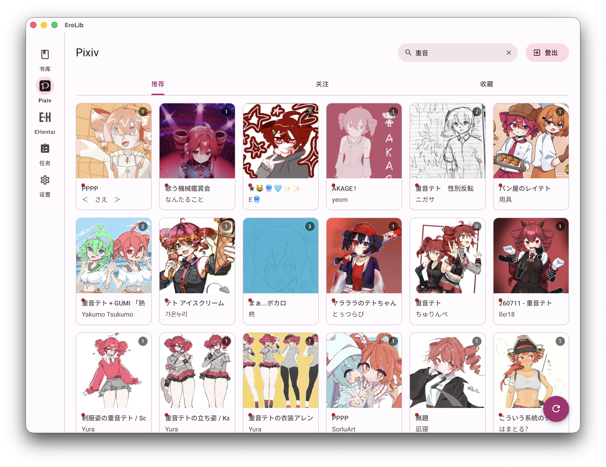
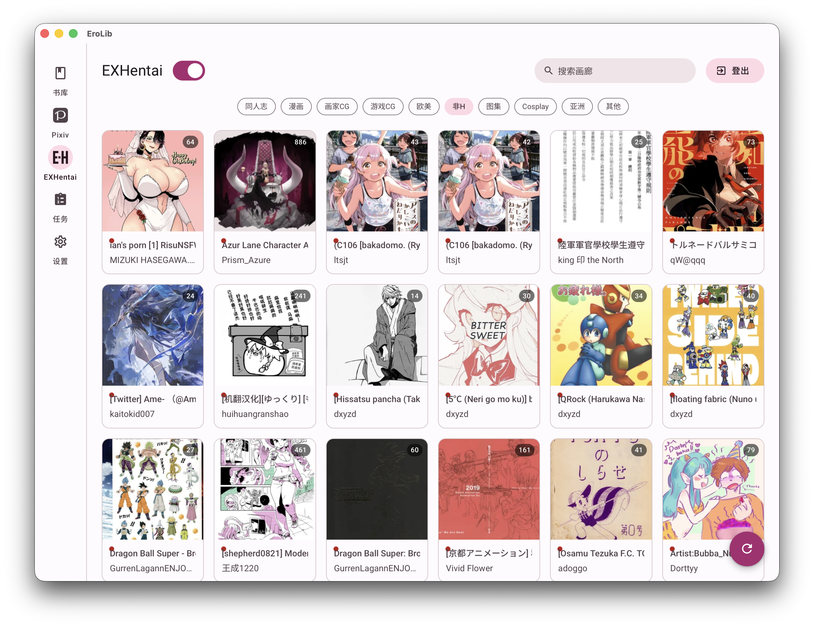
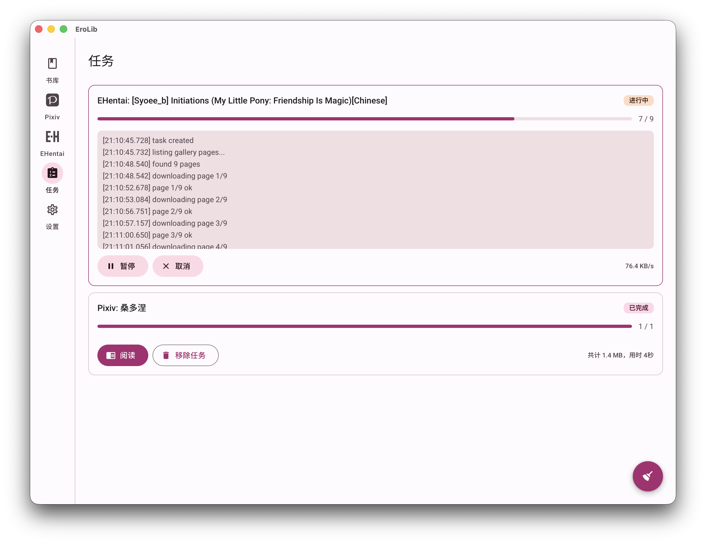
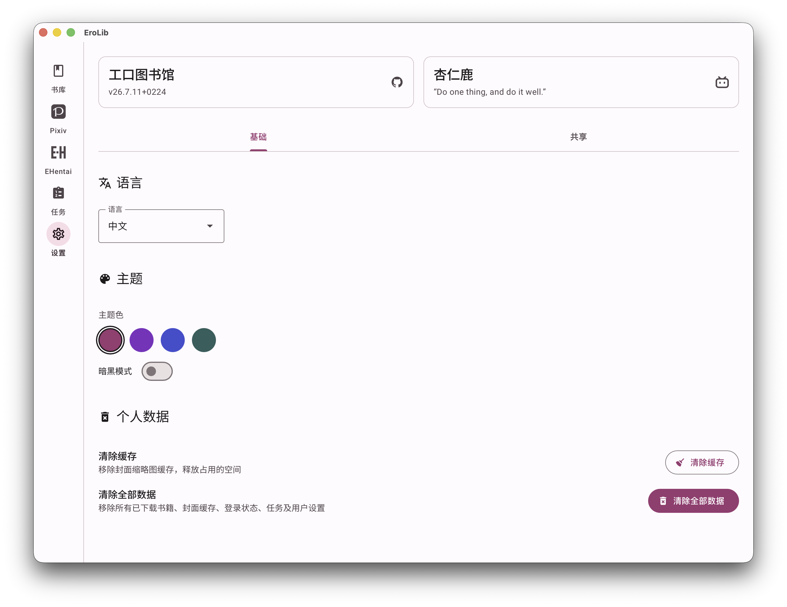

<div align="center">

# 📚 EroLib

### 工口图书馆 · 一站式成人向漫画本地库

**浏览 → 下载 → 阅读 · 全程本地**

Tauri 2 · Vue 3 · Rust · Material Design 3

[](./LICENSE)
[](https://tauri.app)
[](https://vuejs.org)
[](#-下载安装)

</div>

> **EroLib** 是一个桌面端的本地漫画库管理器，内置 **Pixiv** 与 **EHentai / EXHentai** 的浏览式下载，开箱即用的 **CB7** 书库与沉浸式阅读器，并通过 **OPDS / RSS** 把书库共享给同一局域网内的任何设备。它把「找图 → 下本 → 看本」收进一个连贯的 Material Design 3 界面里，一切数据都留在你自己的机器上。

<div align="center">

**[✨ 核心特性](#-核心特性)** · **[📸 截图](#-截图)** · **[📥 下载](#-下载安装)** · **[🛠️ 构建](#-自行构建)** · **[❓ FAQ](#-faq)**

</div>

---

## ✨ 核心特性

### 📖 本地书库
- 导入 **CB7 / CBZ / CBR / PDF**，封面网格直观浏览
- 全文搜索匹配 **标题 / 作者 / 标签**；标签 chip 行 **并集 (OR)** 筛选（上限 30，满则折叠）
- 低清缩略图缓存到 **IndexedDB**，二次打开秒级加载
- 保留书源元信息（**作者 · 发布日期 · 来源 URL**），支持 **ComicInfo.xml** 无损导出 / 导入往返

### 🖼️ 沉浸式阅读器
- 一级页面、全窗口沉浸阅读，进出强制暗黑模式（退出自动恢复）
- **贴合屏幕 / 贴合内容** 双缩放模式，进度滑块 + 键盘翻页
- 自动记忆每本书的阅读进度
- **动图 (ugoira) 原生支持**：保留原始帧序列 + 逐帧延时，按原始节奏无缝循环——**不二次编码**，转换瞬时、加载快、无损且保留原分辨率；兼容历史 GIF / APNG 旧书

### 🎨 Pixiv 浏览式下载
- 登录后浏览式下载：**推荐 / 关注 / 收藏** 三大 feed + 关键词搜索
- IntersectionObserver 懒加载，无限滚动
- 卡片 **三态**：本地已有 → 点进阅读；下载中 → 遮罩 + 手搓 SVG 环形进度；未下载 → 红点提示
- 封面走后端代理，绕过 `i.pximg.net` 防盗链
- 动图 (ugoira) 完整下载与回放

### 🔞 EHentai / EXHentai 浏览式下载
- 登录后 **关键词搜索 + 10 大分类**（同人志 / 漫画 / 画家CG / 游戏CG / 欧美 / 非H / 画像集 / Cosplay / 亚洲 / 杂项）多选并集筛选
- **EXHentai 一键切换**（需 exhentai 资格）；未登录时自动隐藏搜索框与 EXHentai 开关
- 同样三态卡片 + 懒加载无限滚动

### ⚙️ 任务系统（aria2 后端）
- 所有下载统一经 **TaskManager + aria2**，无进程内回退
- 任务页是 **左右分栏工作区**：左侧任务卡片（运行中右下角实时显示下行速度），右侧详情 pane（步骤日志、进度、创建 / 完成时间、操作区）
- 任务上限 **100 条**，完成后记录 `book_id`，详情区一键跳转阅读器
- 支持 **暂停 / 继续 / 取消 / 重试**，非侵入式 toast 通知

### 🌐 OPDS / RSS 共享服务器
- 内置 **OPDS**（端口 5269）与 **RSS**（1269）服务器
- 监听 `0.0.0.0`，把书库开放给同一 Wi-Fi / 局域网的阅读器（Panels、Chunky、 energilse 等）与 RSS 订阅器
- feed 内链接使用 **本机局域网 IP**，其它设备开箱即达
- 设置页单按钮 toggle，运行时端口锁定并标注实时地址
- ⚠️ 默认**无鉴权**，公共网络下建议手动关闭

### 🎨 主题与多语言
- **Material Design 3** 动态主题：种子色 + 亮 / 暗模式，全应用 token 实时切换
- **中文 / English / 日本語** 三语界面，跟随系统或手动切换
- 五个主页面各自记忆当前 tab 与滚动位置

---

## 📸 截图

| 书库 | 阅读器 |
|:---:|:---:|
|  |  |

| Pixiv 浏览 | EHentai 浏览 |
|:---:|:---:|
|  |  |

| 任务 | 设置 |
|:---:|:---:|
|  |  |

---

## 📥 下载安装

前往 **[GitHub Releases](https://github.com/wpy030414/erolib/releases)** 下载最新版本：

| 平台 | 安装包 |
|---|---|
| **macOS**（Apple Silicon） | `EroLib_*_aarch64.dmg` |
| **Windows** | `EroLib_*_x64-setup.exe` / `.msi` |

- 🐾 **aria2 已内置打包**，无需额外安装任何下载工具。
- macOS 首次打开若提示「无法验证开发者」，前往 **系统设置 → 隐私与安全性 → 仍要打开**。
- Windows 如被 SmartScreen 拦截，选择「仍要运行」。

---

## 🛠️ 自行构建

### 环境要求

- **[Rust](https://rustup.rs)**（stable 工具链）
- **[Node.js](https://nodejs.org)** ≥ 18 与 **[pnpm](https://pnpm.io)**
- macOS：Xcode Command Line Tools（`xcode-select --install`）
- Windows：MSVC 构建工具（Visual Studio Build Tools）

### 步骤

```bash
pnpm install          # 安装前端依赖
pnpm tauri dev        # 开发模式（热重载）
pnpm tauri build      # 构建生产包（.app / .dmg / .exe / .msi）
```

构建产物位于 `src-tauri/target/release/bundle/`。

---

## 🧱 技术栈

**前端**
- [Vue 3.5](https://vuejs.org) `<script setup>` + TypeScript + Vite
- [Pinia](https://pinia.vuejs.org) + Vue Router
- [@material/web](https://github.com/material-components/material-web)（Google Material Design 3 Web Components）
- [@material/material-color-utilities](https://github.com/material-foundation/material-color-utilities) 动态主题色生成
- [@mdi/js](https://mdi/svg) 图标 · [idb](https://github.com/jakearchibald/idb) IndexedDB 封装

**后端（Rust）**
- [Tauri 2](https://tauri.app) 桌面框架
- [axum](https://github.com/tokio-rs/axum) OPDS / RSS HTTP 服务器
- [sqlx](https://github.com/launchbadge/sqlx) + SQLite 元数据
- [aria2](https://aria2.github.io) 下载引擎（内置二进制）
- [reqwest](https://github.com/seanmonstar/reqwest) · [scraper](https://github.com/causal-agent/scraper) 网络与解析
- [image](https://github.com/image-rs/image) · [zip](https://github.com/zip-rs/zip) · [quick-xml](https://github.com/tafia/quick-xml) · [boa_engine](https://github.com/boa-dev/boa)

---

## 📁 项目结构

```
erolib/
├── src/                      # 前端 Vue 源码
│   ├── components/           # 共享组件（卡片、图标、Shell、Toast…）
│   ├── i18n/                 # 三语字典 (zh / en / ja)
│   ├── services/             # API、MD3 主题引擎、IndexedDB 缩略图缓存
│   ├── stores/               # Pinia stores（书库 / 浏览 / 任务 / 设置 / 主题）
│   ├── styles/               # MD3 token 与工具类
│   └── views/                # 页面（Library / Reader / Pixiv / EHentai / Tasks / Settings）
├── src-tauri/                # Rust 后端
│   ├── src/
│   │   ├── commands/         # Tauri 命令（book / pixiv / ehentai / server / tasks …）
│   │   ├── services/         # 业务（task_manager / aria2 / pixiv / ehentai / opds / rss …）
│   │   ├── db/  models/      # SQLite 与数据模型
│   │   └── main.rs           # 命令注册入口
│   ├── binaries/aria2c-bin/  # 内置 aria2 二进制（macOS / Windows）
│   └── tauri.conf.json       # 应用与打包配置
└── docs/assets/              # 截图
```

---

## 🏗️ 架构亮点

- **统一任务管线**：所有下载（Pixiv 收藏 / 关注 / 单稿件 / 用户作品、EHentai 画廊）都进同一个 `TaskManager` 队列，底层统一走 aria2，带步骤日志、实时下行速度、`book_id` 回填与 100 条上限。
- **ugoira 无损处理**：动图保留原始 jpg 帧序列与逐帧延时（DB JSON），阅读器按时长定时播放——不二次编码，转换瞬时、加载快、无损、原分辨率。
- **封面缩略图双层缓存**：后端降采样最长边 256px JPEG，前端落 IndexedDB，避免重复解码大图。
- **原生 cookie 采取**：macOS 上通过 `WKHTTPCookieStore` 原始 FFI 精确捕获 / 删除登录 cookie；登出按版块（pixiv.net / e-hentai.org）选择性清理，不误伤主窗口数据。
- **局域网书库共享**：OPDS / RSS 监听 `0.0.0.0` 并以本机 LAN IP 作为 feed base，外部阅读器开箱即达。
- **ComicInfo.xml 往返**：cb7 导出 / 导入元信息无损，`ero:` 命名空间携带来源与动图延时。

---

## 🗺️ 路线图

- [ ] Linux 平台支持（补 aria2 二进制）
- [ ] 阅读器书签与章节目录
- [ ] 更精细的标签 / 收藏夹管理
- [ ] 更多下载源接入
- [ ] 跨设备书库同步

---

## ❓ FAQ

**Q：需要自己安装 aria2 吗？**
不需要。aria2 二进制已随应用打包（macOS / Windows），开箱即用。

**Q：Pixiv / EHentai 怎么登录？**
点击对应页面的「登录」按钮，会打开应用内浏览器；完成登录后 EroLib 会自动采取 cookie 并识别用户，无需手动复制。

**Q：OPDS / RSS 安全吗？**
默认监听全部网卡、无鉴权，方便局域网内设备访问。在公共 / 不可信 Wi-Fi 下，请到「设置 → 共享」手动关闭服务器。

**Q：支持哪些文件格式？**
导入：CB7 / CBZ / CBR / PDF；下载产物：CB7（动图为帧序列 + 延时）。

**Q：数据存在哪里？**
- macOS：`~/Library/Application Support/im.xrl.erolib/`
- Windows：`%LOCALAPPDATA%\im.xrl.erolib\`

**Q：macOS 提示「无法验证开发者」怎么办？**
应用未做代码签名。前往「系统设置 → 隐私与安全性」，点击「仍要打开」即可。

---

## 💎 致谢

- [Tauri](https://tauri.app) — 构建轻量跨平台桌面应用的框架
- [Material Web Components](https://github.com/material-components/material-web) — MD3 组件库
- [aria2](https://aria2.github.io) — 强大的命令行下载引擎
- [Pixiv](https://www.pixiv.net) 与 [e-hentai.org](https://e-hentai.org) — 数据来源

---

## 📄 许可证

本项目基于 **[DO WHAT THE FUCK YOU WANT TO PUBLIC LICENSE](./LICENSE)** (WTFPL v2) 开源。

Copyright © 2021-Present **杏仁鹿** `<krkr@xrl.im>`

---

## 👤 作者

**杏仁鹿** — *Do one thing, and do it well.*

- 哔哩哔哩：[@杏仁鹿](https://space.bilibili.com/92465406)
- GitHub：[@wpy030414](https://github.com/wpy030414/erolib)
- 邮箱：`krkr@xrl.im`

<div align="center">

⭐ 如果 EroLib 对你有帮助，欢迎给个 Star！

</div>
