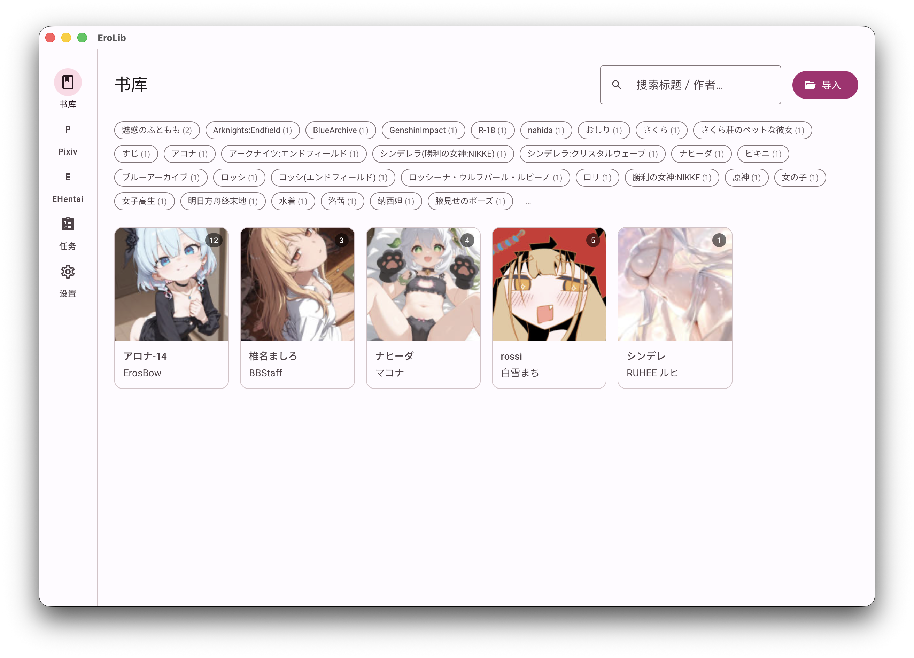

# EroLib

工口图书馆 —— 基于 Tauri 2 + Vue 3 的本地漫画库管理器，支持 Pixiv 与 EHentai 下载。

## 截图

### 书库



### 阅读器


## 技术栈

- **桌面框架**：Tauri 2
- **前端**：Vue 3.5 + Vue Router + Pinia + TypeScript + Vite
- **UI 组件**：Google Material Design 3 Web Components（[@material/web](https://github.com/material-components/material-web)）
- **主题**：@material/material-color-utilities 动态生成 MD3 token，动态主题色 + 暗黑模式
- **图标**：@mdi/js

## 功能

- **本地书库**：导入 CB7/CBZ/CBR/PDF，封面网格浏览；低清缩略图缓存到 IndexedDB，二次打开秒级加载；搜索支持标题/作者/标签，标签 chip 并集(OR)过滤
- **阅读器**：沉浸式全窗口阅读，「贴合屏幕 / 贴合内容」双模式，进度滑块 + 键盘翻页，自动保存阅读进度；**动图(ugoira)自动转 GIF** 并循环播放
- **Pixiv**：浏览式关注 / 收藏 feed，懒加载无限滚动，单击卡片即下载单稿件；卡片环形进度 + 完成后自动识别为本地书
- **EHentai**：登录后按画廊 URL 下载
- **任务系统**：统一下载队列（aria2 后端），实时进度与非侵入式完成提醒
- **OPDS / RSS 服务器**：在设置中启用，供外部阅读器访问
- **多语言**：中文 / English / 日本语
- **状态持久化**：五个主页面各自记忆当前 tab 与滚动位置

## 快速开始

```bash
pnpm install
pnpm tauri dev      # 开发模式
pnpm tauri build    # 构建生产包
```

## 项目结构

```
erolib/
├── src/                 # 前端 Vue 源码
│   ├── components/      # 共享组件
│   ├── i18n/            # 三语字典 (zh / en / ja)
│   ├── services/        # API、主题引擎、缩略图缓存 (IndexedDB)
│   ├── stores/          # Pinia stores
│   ├── styles/          # MD3 token 与工具类
│   └── views/           # 页面 (Library / Reader / Pixiv / EHentai / Tasks / Settings)
└── src-tauri/           # Rust 后端
```

## 开发者提示

详见 [AGENTS.md](AGENTS.md)。要点：

- MWC 组件标签以 `md-` 开头，Vue 中已通过 `template.compilerOptions.isCustomElement` 处理。
- 新增后端命令需同步注册到 `main.rs` 的 `invoke_handler` 与 `src/services/api.ts`，且 DTO 加 `#[serde(rename_all = "camelCase")]`。
- 阅读器进出强制暗黑模式，退出后恢复用户设置。
